# Tinydb
&emsp;&emsp;
## 概述
&emsp;&emsp;该系统是一个在线数据库做题系统。<br/>
&emsp;&emsp;分为前台和后台。学生和老师用户在注册账号后可以在前台做和数据库有关的题，老师用户可以登入后台进行用户和试题的查看和修改（添加、删除、编辑）。
&emsp;&emsp;
## 技术栈
```
python3.6 + django1.11* + mysql + pymysql + jqury + d3 + bootstrap

```
&emsp;&emsp;
## 使用方法
### 下载代码
```
mkdir tinydb/
cd tinydb
git clone https://github.com/SlashBaby/Tinydb.git
```
### 配置数据库
- 修改tinydb/settings.py文件里的如下内容（用于连接数据库）。
```
DATABASES = {
    'default': {
        'ENGINE': 'django.db.backends.mysql',
        'NAME': 'testdb',
        'USER': '<root_user_name>',
        'PASSWORD': '<root_user_password>',
        'HOST': '<your_host>',
        'PORT': '<your_port>',
    }
}
```
- 创建两个新的数据库，在mysql中输入如下命令。
```
create database pub; // 用来存放所有题需要的表
create database testdb; // 用来存放用户、试题信息、得分情况

```
- 在testdb里面创建几张新的表。
```
// 用户表
CREATE TABLE `users` (
  `sid` varchar(50) NOT NULL,
  `password` varchar(45) NOT NULL,
  `state` tinyint(1) DEFAULT NULL,
  `id` int(11) NOT NULL AUTO_INCREMENT,
  PRIMARY KEY (`id`),
  UNIQUE KEY `sid_UNIQUE` (`sid`)
) ENGINE=InnoDB AUTO_INCREMENT=42 DEFAULT CHARSET=utf8mb4 COLLATE=utf8mb4_0900_ai_ci

// 题目信息表
CREATE TABLE `tests` (
  `id` int(11) NOT NULL,
  `name` varchar(20) NOT NULL,
  `content` text,
  `answer` text,
  `index` int(11) DEFAULT NULL,
  PRIMARY KEY (`id`)
) ENGINE=InnoDB DEFAULT CHARSET=utf8mb4 COLLATE=utf8mb4_0900_ai_ci

// 得分表
CREATE TABLE `score` (
  `id` int(11) NOT NULL AUTO_INCREMENT,
  `tid` int(11) NOT NULL,
  `uid` int(11) NOT NULL,
  `state` tinyint(1) NOT NULL,
  PRIMARY KEY (`id`),
  KEY `tid_idx_1` (`tid`)
) ENGINE=InnoDB AUTO_INCREMENT=9 DEFAULT CHARSET=utf8mb4 COLLATE=utf8mb4_0900_ai_ci
```
### 导入表
&emsp;&emsp;向pub数据中加入题目所需要的表格。
### 创建第一个管理员用户
&emsp;&emsp;用来登入后台。
```
// 在用户表里注册
insert into testdb.users(sid, password, state) values('admin', '123', 1);

// 给其创建一个数据库，用于存放该用户创建的所有的表
create database admin;

// 在数据库中创建一个相应的用户并赋予对应的权限
create user admin identified by 123;
grant select, insert, update, delete on admin.* to admin;
grant create, drop, select, insert, update, delete on testdb.* admin;
flush privileges;

```
### 运行
&emsp;&emsp;在和manage.py同级的目录下运行以下指令。
```
python3 manage.py runserver 0:8000

```

### 进入后台
&emsp;&emsp;默认连接的是网站的前台，如果需要登入后台请输入如下的地址。
```
http://0.0.0.0:8888/myadmin/

```
&emsp;&emsp;
## 前台
### 登陆页面
&emsp;&emsp;在该界面可以进行登录。
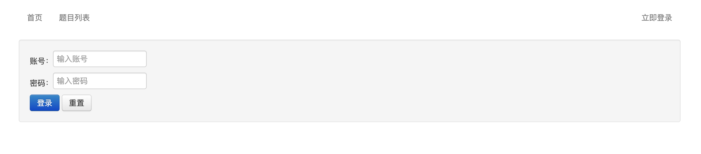
### 首页
&emsp;&emsp;在首页可以跳转到试题列表页面（如果没有登陆会自动跳转到登陆页面），或者执行登陆和登出功能。
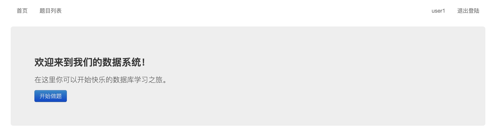
### 题目列表页面
&emsp;&emsp;该界面可以浏览所有的试题的序号、题目以及状态（未操作、正确、错误）。并且可以任意选择一道题进行做题。
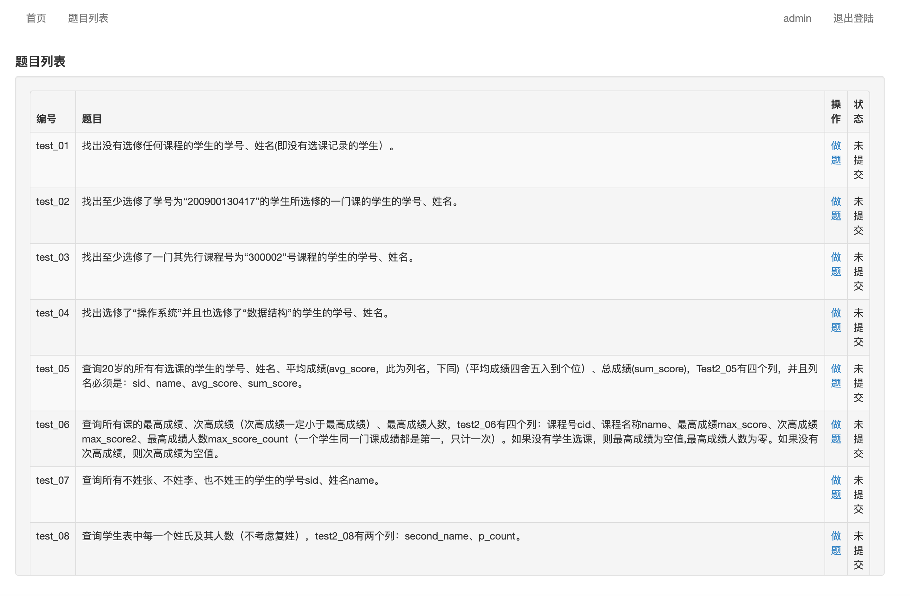
### 题目详情页面
&emsp;&emsp;该界面主要用来做题。上面的左边是题目的详细描述，可以查看下一题、上一题，或者检测本题。上面的右边可以输入一条或者多条mysql的sql语句。当点击提交按钮的时候，下面会为每一条sql语句返回一个结果。
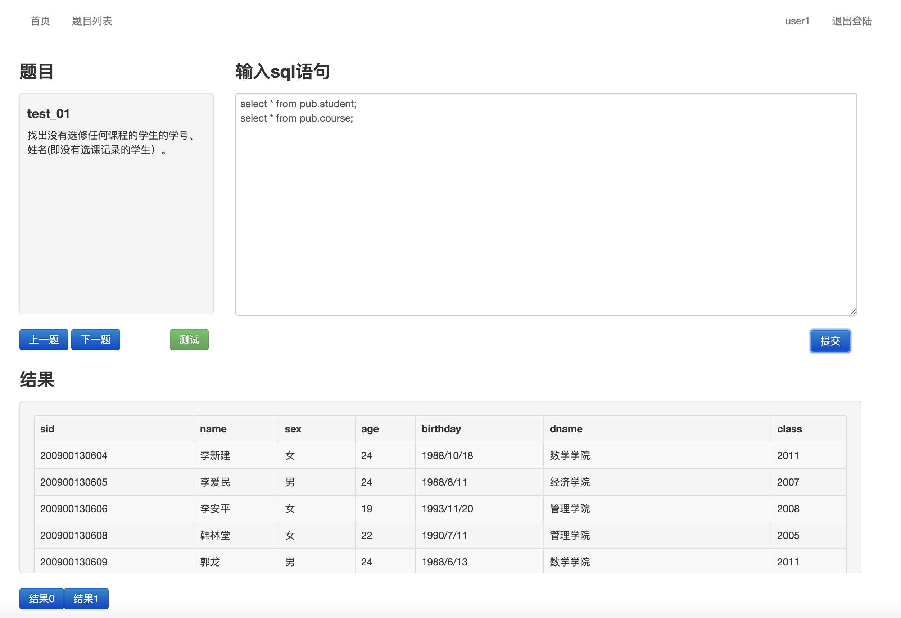
&emsp;&emsp;
## 后台
### 登录页面
&emsp;&emsp;在该界面老师用户可以登录，如果不登陆无法访问后台的其他内容。
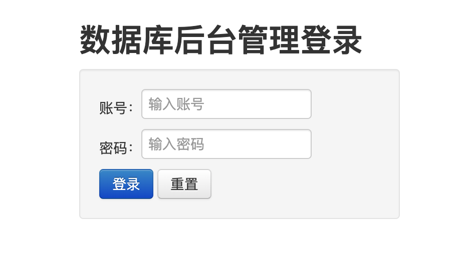
### 首页
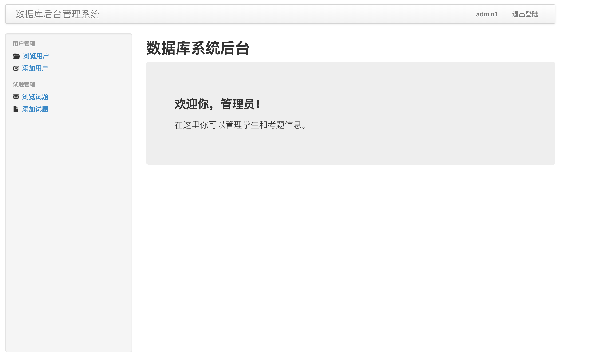
### 用户管理
- 浏览用户：可以对用户进行删除。
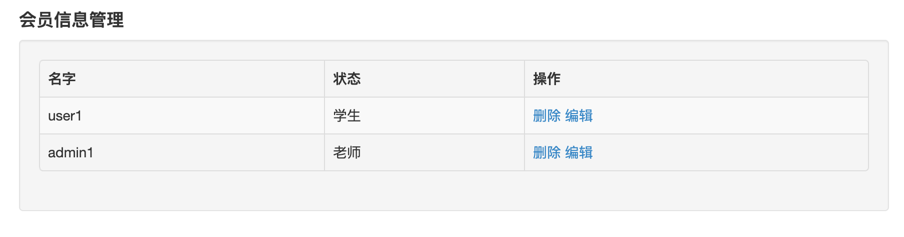
- 添加用户：可以添加老师和学生类型的用户，默认添加学生类型的用户。
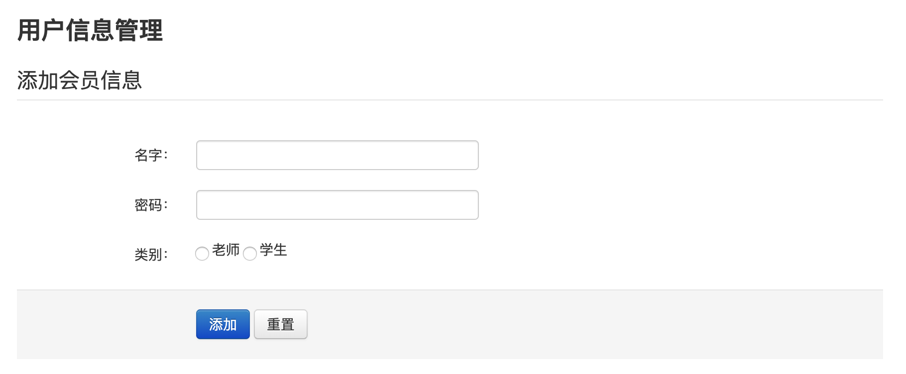
- 编辑用户：修改姓名，权限，暂不支持修改密码。
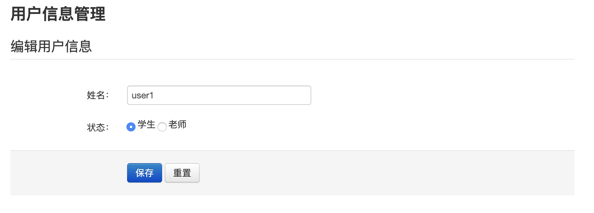
### 题目管理
- 浏览题目：可以对题目进行删除。
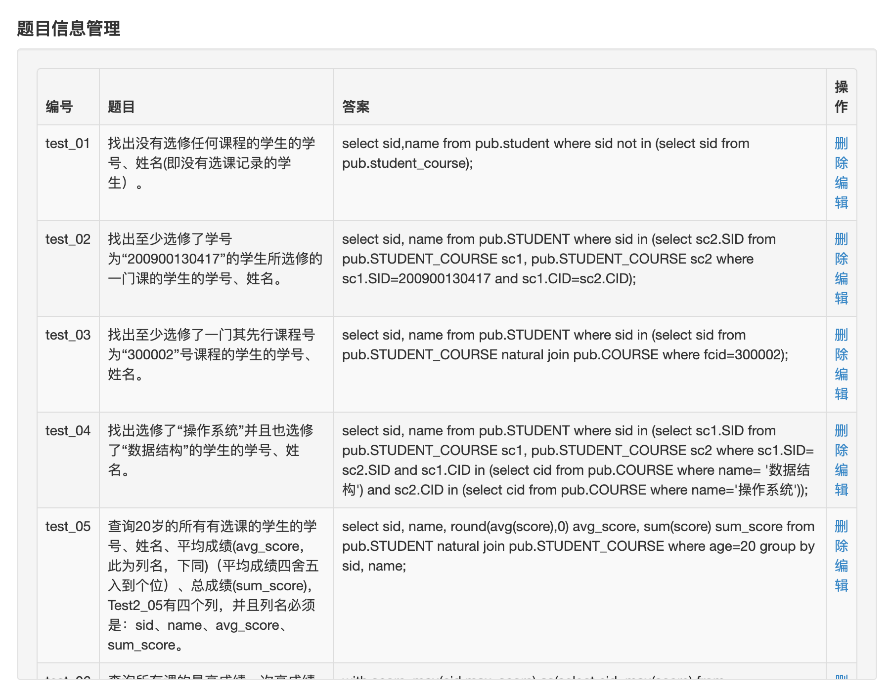
- 添加题目：题目的答案为正确的sql语句。
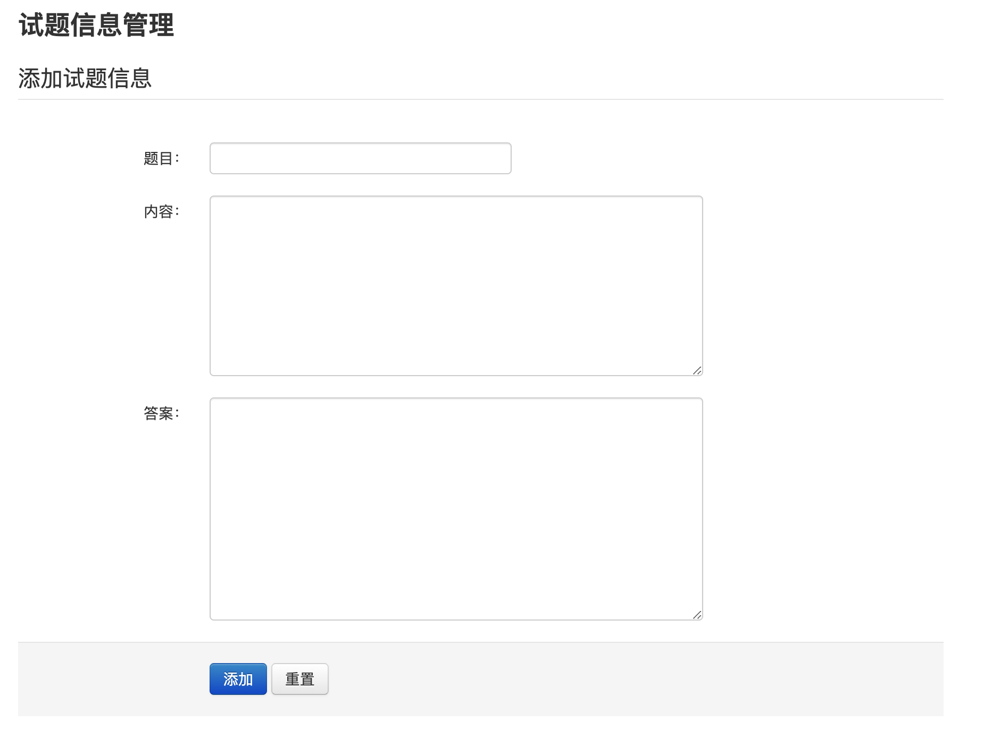
- 编辑题目：修改题目和内容。
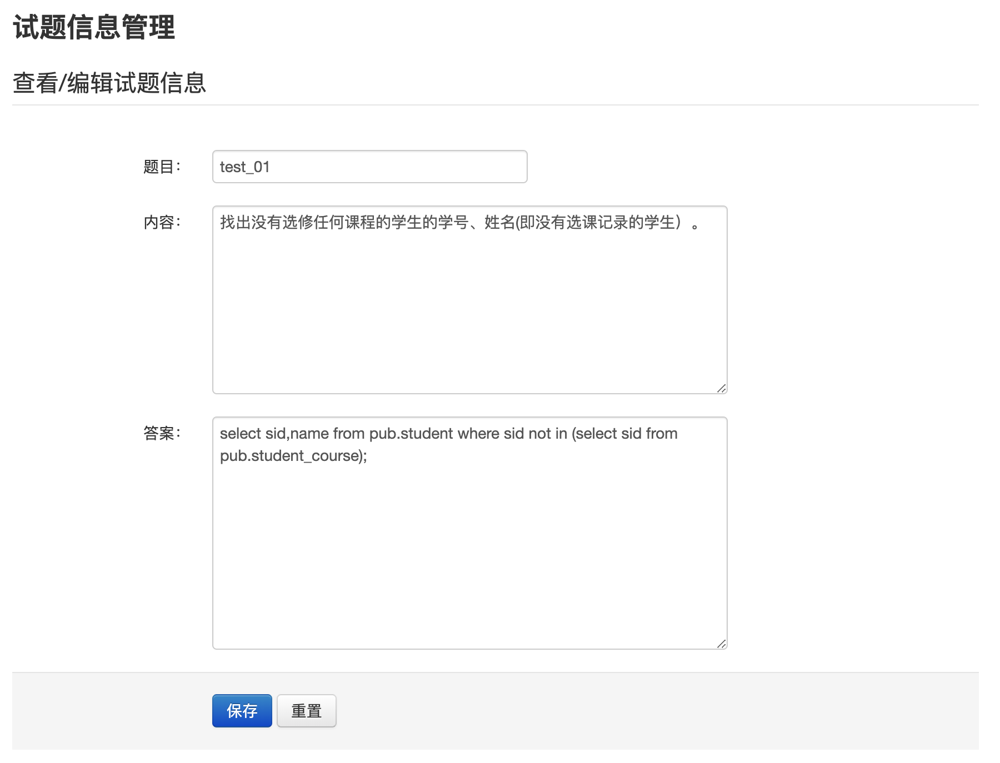